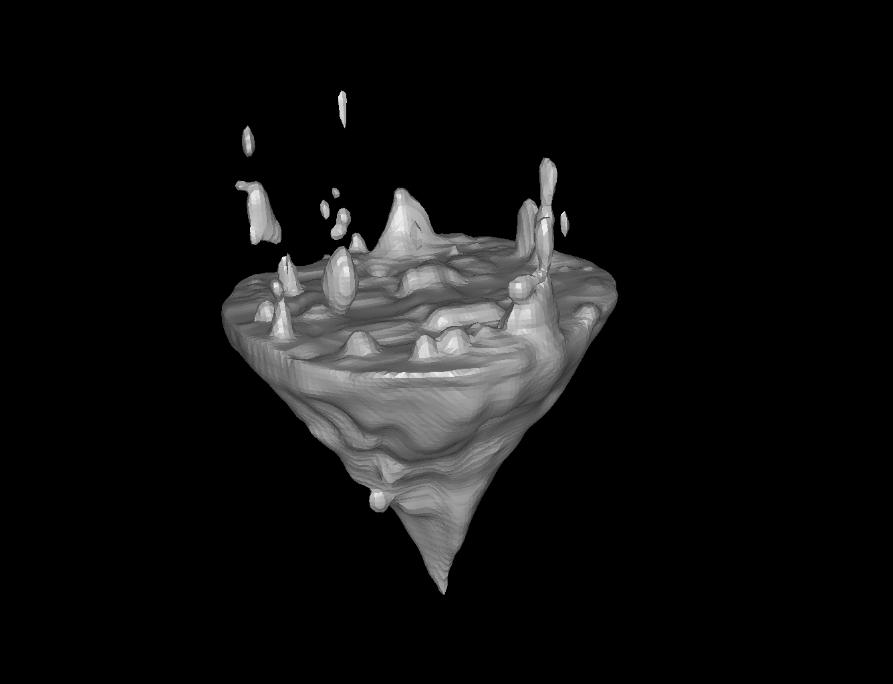
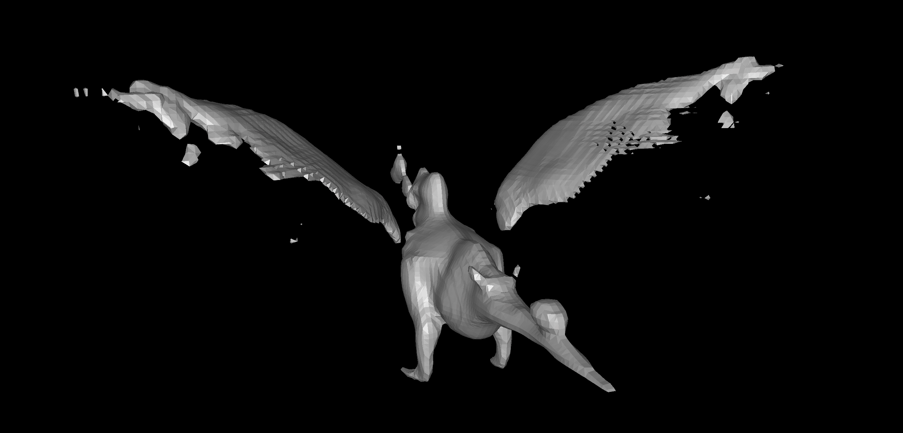
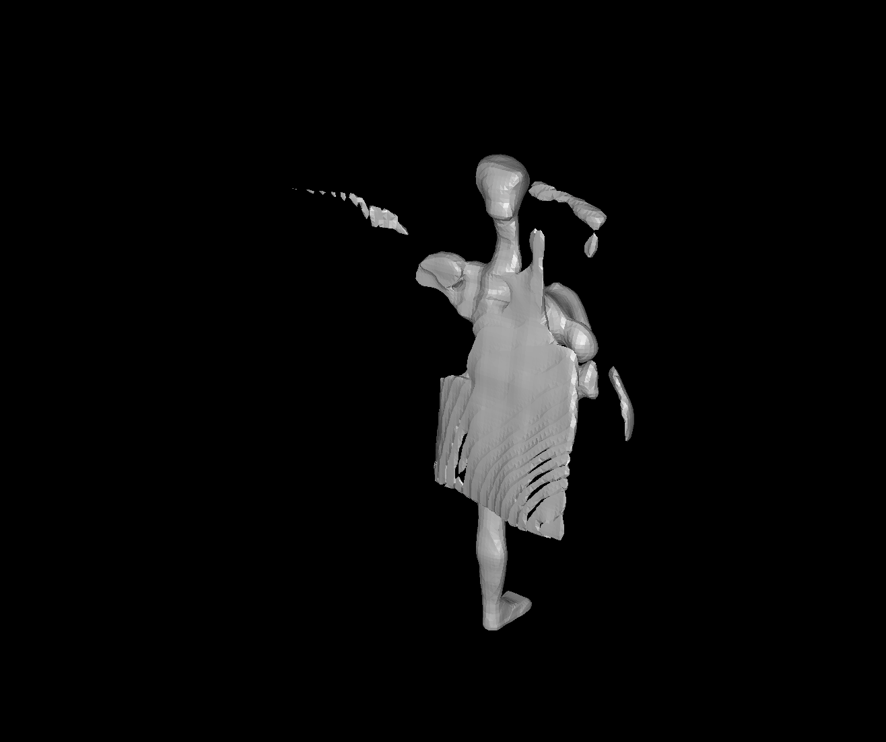

**3D Model Generation with Shap-E**

This project demonstrates a text-to-3D pipeline using OpenAI's [Shap-E](https://github.com/openai/shap-e) model. The tool takes natural language prompts and generates realistic `.glb` 3D models that can be used in games, simulations, or 3D design workflows.

It runs entirely on Google Colab — no GPU required for basic use.


**Model & Tools Used**

- Model: [Shap-E by OpenAI](https://github.com/openai/shap-e)
- Framework: PyTorch
- Platform: Google Colab

---

**Input & Output Examples**

| Prompt                  | Result Preview                           | Download |
|------------------------|-------------------------------------------|----------|
| `A magical floating island` |  | [OBJ File](assets/magical_floating_island.obj) |
| `A katana`             |       | [OBJ File](assets/a_katana.obj) |
| `A dragon`             |       | [GLB File](assets/a_dragon.obj) |
| `An elf archer`        |             | [GLB File](assets/an_elf_archer.obj) |

---

** Try It Yourself on Colab**

🔗 **[Open in Google Colab](https://colab.research.google.com/drive/1agLDSY86iPcp-DX3oA1YvMNCkJDEzY7r#scrollTo=_auEren5kYMn)**

No setup required — just follow the cells and add your own prompts.

---

## 🛠️ Getting Started Locally (Optional)

> Only needed if you want to clone and run locally.

```bash
git clone https://github.com/foreverlennek/3d-ml-generator-demo.git
cd 3d-ml-generator-demo
pip install -r requirements.txt
